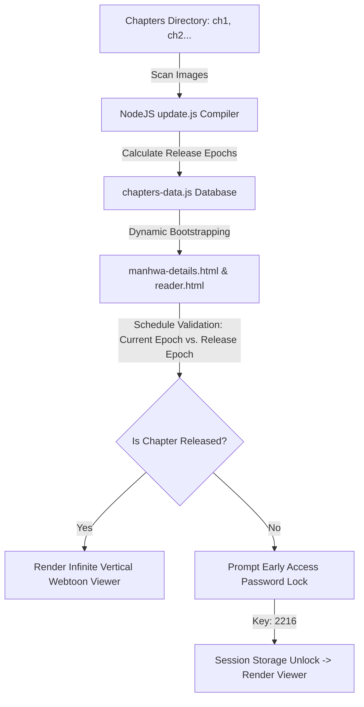

# 🌌 INKVERSE — Premium Manhwa Hub & Creator's Diary

[]()
[]()
[](https://github.com/rajuyuvaraj/MANHWA)

**INKVERSE** is a high-fidelity, beautifully engineered, single-page-styled web application tailored for hosting custom manhwa (comics/manga) chapters along with an interactive creator's voice/audio diary. It is designed to deliver a premium, visually arresting experience combining comic-book printed aesthetics with high-performance modern web capabilities.

Built with a curated, dark-gothic palette, custom cursor physics, parallax layers, and an automated publishing system, this project serves as a premium portfolio piece demonstrating cutting-edge frontend implementation, DOM performance tuning, and custom Node.js build-automation workflows.

---

## 🎨 Premium Visual Experience & Design Philosophy

INKVERSE was developed with extreme attention to visual excellence and sensory detail, steering clear of standard templates to create a highly tailored "wow" factor:

*   **Harmony of Dark Aesthetics:** Styled using curated CSS custom properties (HSL tokens) including a deep obsidian black (`--ink`), soft canvas ivory (`--paper`), rich velvet crimson (`--crimson`), and warm metallic gold (`--gold`).
*   **Custom Blend-Mode Cursor System:** Features a custom cursor engine tracked via high-frequency requestAnimationFrame handlers, coupled with an outer lag-ring. Interactive elements scale the cursor and trigger CSS `mix-blend-mode: difference` adjustments.
*   **Halftone Comic Print Overlay:** Implements a subtle graphic-design halftone dotted pattern and fractal noise filters using pure SVG-data URI backgrounds and HSL radial gradients to capture the retro texture of comic book print.
*   **Dynamic Motion & Parallax:** Fluid scroll-driven transitions handled via `IntersectionObserver` elements alongside asynchronous math translation algorithms for parallax background offsets.

---

## ⚡ Core Technical Architecture & Features



### 1. Automated Publisher Pipeline (`update.js`)
*   **Dynamic Scanning:** A command-line utility built on Node.js that scans the localized directory `/chapters/` for chapter folders (e.g., `ch1`, `ch2`), counts the constituent pages, and detects raw image extensions dynamically.
*   **Algorithmic Epoch Releases:** Programmatically schedules chapters to drop exactly 24 hours apart, starting from a configured base time (`March 18, 2026 at 18:00:00`).
*   **Automated JS Database Compilation:** Compiles files into a unified JSON database `chapters-data.js` containing release timestamps, page numbers, extensions, and formatted titles.

### 2. Immersive Webtoon Reader (`reader.html`)
*   **Infinite Vertical Scroll Layout:** Tailored to mimic standard comic/webtoon reading layouts with zero gaps, fully centered focus widths, and optimized element heights.
*   **Performance-Optimized Lazy Loading:** Utilizes native browser loading parameters to delay page rendering off-screen, maintaining light memory signatures on high-resolution image pages.
*   **Scroll-Driven Distraction-Free Mode:** Implements dynamic velocity tracking on user scroll—automatically hiding the navigation headers on scroll-down and sliding them back into place on scroll-up.

### 3. Gated Client-Side Security & Early Access
*   **Time-Gate Engine:** The reader checks the client-side system clock against the compiled chapter release epoch.
*   **Role-Based Password Bypass:** If a chapter is locked, the application displays a retro countdown timer and prompts for a secret early access password (`2216`).
*   **Session Management:** Successful password entries write authorization tokens to the browser's `sessionStorage` ensuring persistent access on reload without server queries.

### 4. Interactive Media Player & Audio Logs (`audio-logs.html`)
*   **Custom Audio UI Wrapper:** A fully engineered audio dashboard wrapping the standard HTML5 audio element. Features a fluid progress track, seek bar coordinates, current/remaining timing tags, and hover state transitions.
*   **State-Driven Playback:** Tracks active track indexes and toggle-states, visually rendering active listening states across the directory listings.

---

## 🛠️ Technology Stack

| Layer | Technologies Used | Key Standard / Feature |
| :--- | :--- | :--- |
| **Frontend Layout** | Semantic HTML5, CSS3 Variables | HSL Custom Tokens, Aspect-Ratio Grid |
| **Animation Systems** | Vanilla CSS Keyframes, requestAnimationFrame | Hardware-Accelerated Transforms |
| **Interactivity** | ES6+ Modern JavaScript | IntersectionObserver, URLSearchParams, sessionStorage |
| **Audio Mechanics** | HTML5 Audio API | Custom UI Wrapper, Real-time duration binding |
| **Build Automation** | Node.js (V20+) | File System (`fs`), Path Resolution (`path`) |
| **Version Control** | Git / GitHub | Continuous Branch Management |

---

## 📁 Repository Structure

```directory
MANHWA/
├── audio/                      # Audio storage directory for creator logs
├── chapters/                   # Chapter images organized by folder
│   ├── ch1/                    # Chapter 1 subfolder
│   │   ├── 1.png
│   │   └── ...
│   └── ...
├── images/                     # UI Assets (Logo, cover image, backgrounds)
│   └── hero-image.jpg
├── index.html                  # Landing page & Main application interface
├── manhwa-details.html          # Individual title page & Chapter index
├── reader.html                 # Infinite vertical webtoon reader page
├── audio-logs.html             # Interactive audio logs page
├── chapters-data.js            # Auto-generated chapter database & schedule
├── update.js                   # Node.js scan and database compiler script
├── .gitattributes              # Git configuration
└── README.md                   # Project documentation
```

---

## 🚀 Installation & Local Development

### 1. Clone the repository
```bash
git clone https://github.com/rajuyuvaraj/MANHWA.git
cd MANHWA
```

### 2. Populate Chapter Images
Arrange your chapter images inside the `chapters` folder following a standard layout:
```text
chapters/
  ├── ch1/
  │    ├── 1.png
  │    ├── 2.png
  │    └── 3.png
  └── ch2/
       ├── 1.jpg
       └── 2.jpg
```

### 3. Run the Database Compiler
To build the dynamic release schedule and compile file counts, execute the compiler script using Node.js:
```bash
node update.js
```
*This will automatically generate/overwrite `chapters-data.js` to match the exact directory makeup of your folders.*

### 4. Host the Application
Since this project uses client-side fetch modules and dynamic cache-bypassing script inclusions, it is recommended to run the project using a local development server:
*   **VS Code:** Install "Live Server" and click "Go Live" from `index.html`.
*   **Python:** Run `python -m http.server 8000` in the directory.
*   **Node.js:** Run `npx serve .` in your terminal.

---

## 💎 Resume Highlights & Engineering Accomplishments
*(Perfect for copy-pasting directly into your resume/portfolio!)*

*   **Performance Optimization:** Programmed interactive custom cursor coordinates and lag-rings using optimized rendering loops (`requestAnimationFrame`), reducing page reflows and keeping frame rates pinned at a smooth 60fps.
*   **Responsive Media Delivery:** Designed a lightweight HTML5 audio dashboard player and infinite vertical scroll manga viewer featuring native lazy-loading, ensuring clean memory footfalls on high-resolution image rendering.
*   **Automated Build Workflows:** Built a Node.js CLI compile-script executing directory scans and image mappings to automatically output database scripts (`chapters-data.js`), removing manually managed configurations.
*   **Security & Gates:** Formulated a time-locked release system matching standard digital publisher architectures, pairing system epoch evaluations with password overrides (`sessionStorage`) to support secure early-access roles.
*   **Obsession-level UI Detail:** Crafted complex, fluid dark themes with CSS custom properties (variables), responsive custom layouts, parallax, halftone comic texturing, and dynamic interactive state changes.

---

*Made with ❤️ for Ammu.*
